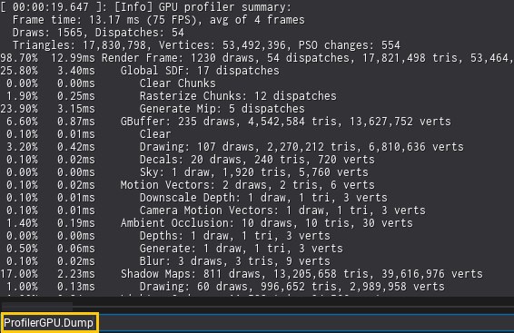

# Debugging Tools

* [Profiler](../../editor/profiling/index.md)
* [Debug View](debug-view.md)
* [View Flags](view-flags.md)

## Test Value

When developing shaders, new rendering techniques, VFX or materials, it's often useful to perform A/B testing of different code paths in a shader or rendering pipeline. To do it, engine contains `Graphics.TestValue` command value as debug utility to control visual or rendering features during development. For example, can be used to branch different code paths in shaders for A/B testing (perf or quality). The value of it can be changed via console or from code (even in non-Release builds).

## Profiler

Graphics profiling can be done via external tools or right inside the engine via [Profiler](../../editor/profiling/profiler.md) or `ProfilerGPU.Dump` command. It profiles next frame(s) rendering performance and dumps the results to the log (as a hierarchy structure). When using more than 1 frame, the results are averaged for more accurate profiling (especially for A/B testing).
