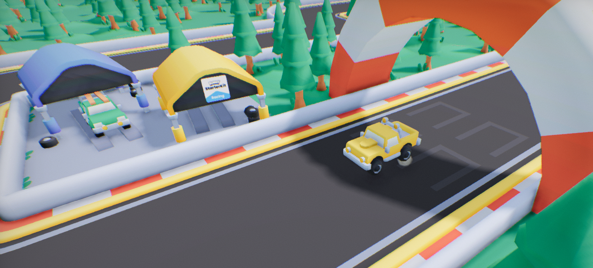
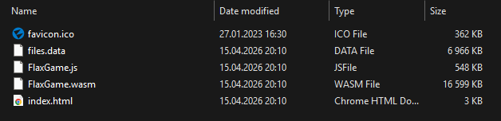

# Web



> [!Warning]
> Warning! Web support is experimental, and not all engine features are implemented (such as C# support).

## Technical information

Flax supports building games for Web that can be run in a browser. Engine with game code are compiled into [WebAssembly](https://webassembly.org/) and use [WebGPU](https://webgpu.org/) for rendering.

### Browser support

Flax uses various features on Web that ensure the final build is fast and small:
* [WebGPU](https://caniuse.com/webgpu) - **rendering** API used to draw,
* [Fixed-width SIMD](https://caniuse.com/mdn-webassembly_fixed-width-simd) - Single Instruction Multiple Data (**SIMD**) extension to WebAssembly,
* [JavaScript Promise Integration](https://caniuse.com/wf-wasm-jspi) - **JSPI** allows to call async code from synchronous WebAssembly which is used by WebGPU async APIs.

The current browser support coverage:

| Browser | Minimum Version | Notes |
|--------|--------|--------|
| **Chrome**/**Edge** | `v137` (May 2025) | |
| **Firefox** | `v147` (Jan 2026) | Requires flag `javascript.options.wasm_js_promise_integration` set in `about:config`. |
| **Safari** | `Safari Technology Preview 238` (Feb 2026) | The latest stable Safari version doesn't have JSPI but the `Technology Preview 238` ships it and works correctly.  |

Flax outputs JavaScript code that checks for the minimum browser version and warns user on startup that the browser needs an update in order to run a game. The same applies to other features such as WebGPU or JSPI.

> [!Tip]
> Game code can access browser name/version info from `WebPlatform::GetUserAgent`.

### JSPI vs ASYNCIFY

**JSPI** is a relitivly new API thus not all browsers support it by default thus it's possible to build engine with old-compatible [Asyncify](https://emscripten.org/docs/porting/asyncify.html) and lower the requrements hovewer recent browsers contain more stable and suabe WebGPU implementation which is desired sinc it's also relatively new API. You can fork engine and change `WithAsyncify` to `1` inside `GraphicsDeviceWebGPU.Build.cs` to build Web game with wider browser support at cost of significantly larger output website files.

### Limitations

* **C# scripting support is not implemented yet**, which means games can use only native C++ scripting (Visual Scripting relies on C# integration).
* Video playback is not yet implemented.
* Audio playback might be delayed until user interacts with a website due to browser security policy.
* By default, game runs on a single thread due to compability/safety issues. Multi-threading can be enabled manually (see section below).
* See more [Portability Guidelines](https://emscripten.org/docs/porting/guidelines/portability_guidelines.html).

### WebGPU

WebGPU is a web graphics API that provides low-level and high-performance access to modern GPU features such as Compute Shaders and Indirect Drawing.

Limitations and notes:
* Texture format support varies across devices thus use `GPUDevice::Instance->GetFormatFeatures(PixelFormat::FORMAT_TO_USE)` to check if specific `FORMAT_TO_USE` has a given flags set,
* By default, engine packs textures using `Basis Universal` format and converts image on a fly to the runtime format which allows a single game build to run on both mobile and desktop GPUs.
* Use browser console output to inspect any problems with rendering. Non-release builds auto-crash after 20 unhandled errors for inspections.
* Shaders are compiled with `glslang` into `SPIRV` and then with `tint` into `WGSL`.
* Use [WebGPU Inspector](https://github.com/brendan-duncan/webgpu_inspector) or [RenderDoc](https://toji.dev/webgpu-profiling/renderdoc) to debug rendering.

RenderDoc debug command for Chrome:

```
set RENDERDOC_HOOK_EGL=0 && "C:\Program Files\Google\Chrome\Application\chrome.exe" --no-sandbox --disable-gpu-sandbox --disable-direct-composition --gpu-startup-dialog --enable-dawn-features=enable_renderdoc_process_injection,disable_symbol_renaming,use_user_defined_labels_in_backend
```

### Threading

Flax has support for multi-threading in browsers via [pthread](https://emscripten.org/docs/porting/pthreads.html) API in Emscripten. Hovewer due to security concerns with `SharedArrayBuffer` due to various exploits, the use of multiple threads for the Web has drawbacks, including the requirement of server-side headers with complete cross-origin isolation. It restricts usage of ads, and third-party integrations on the website hosting your game, which limits the usability.

By default, Flax compiles in a single-threaded mode, which isn't as performant but doesn't require overhead to run game on Web, including on popular Web hosting/publishing services. You can fork engine and edit `Flax.flaxproj` to use threads on Web by enabling it:

```
"Web": {
  "Threads": true,
},
```

## Development Setup

Flax Editor supports building game for Web on both Windows, Linux and Mac. Follow these steps to setup your development PC for building game for Web platform:

* Install [Emscripten](https://emscripten.org/) (min. ver `4.0` but recommended latest `5.0`),
* Set `EMSDK` environment variable to point to Emscripten SDK installation folder,
* If using engine from Flax Launcher, ensure to download **Web (target platform)** files,
* Adjust project scalability (eg. Motion Blur and SSAO might be too intense visuals to run across all hardware),
* Use [Game Cooker](../editor/game-cooker/index.md) to build game for Web.

Use `Release` configuration only for final game build as it doesn't have various tools and no logging inside browser console.

## Serving the files



Flax builds a standalone website for easy game hosting that includes `index.html`, JavaScript files, WebAssembly files, `files.data` with game content and `favicon.ico`. The output files are ready to be zipped and uploaded to the popular Web publishing stores such as [itch.io](https://itch.io/). Game can be self-hosted too, as long as server complies with [Emscripten guidelines](https://emscripten.org/docs/compiling/WebAssembly.html#web-server-setup).

Output game can be tested locally `emrun` tool. See [this documentation](https://emscripten.org/docs/compiling/Running-html-files-with-emrun.html) to learn more about it. Alternatively, you can run `python -m http.server` command and open `http://localhost:8000/` in your browser.

> [!Tip]
> Use developer console inside the browser (`F12` or `Ctrl + Shift + I`) to inspect engine or game logs available in Development or Debug builds.

## Build options

| Property | Description |
|--------|--------|
| **Output** | The built game output folder (relative to the project). |
| **Show Output** | If checked, after building the output folder will be shown in an Explorer. |
| **Configuration Mode** | Game building mode. Possible options: <table><tbody><tr><th>Option</th><th>Description</th></tr><tr><td>**Release**</td><td>The release build ready for shipment. Doesn't output engine logs to the browser console.</td></tr><tr><td>**Debug**</td><td>The debug build for testing and profiling. Most of the code optimizations are disabled for the best debugging experience.</td></tr><tr><td>**Development**</td><td>The development build for testing and profiling but is more optimized for runtime than Debug build.</td></tr></tbody></table>|

## Platform settings

| Property | Description |
|--------|--------|
| **Custom Html** | The custom HTML template for the game page. |
| **Textures Compression** | The output textures compression mode. Possible options: <table><tbody><tr><th>Option</th><th>Description</th></tr><tr><td>**Uncompressed**</td><td>Raw image data without any compression algorithm. Mostly for testing or compatibility.</td></tr><tr><td>**BC**</td><td>Maintains block compression formats BC1-7 that are supported on Desktop but might not work on Mobile.</td></tr><tr><td>**ASTC**</td><td>Converts compressed textures into ASTC format that is supported on Mobile but not on Desktop.</td></tr><tr><td>**Basis**</td><td>Converts compressed textures into Basis Universal format that is supercompressed - can be quickly decoded into GPU native format on demand (BC1-7 or ASTC). Supported on all platforms.</td></tr></tbody></table> |
