# Flax 1.12 release notes

## Highlights

### Web Support

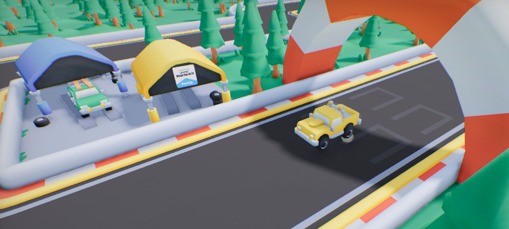

We did it! Flax 1.12 ships with initial **support for building games for Web** that can run in a browser. We use the latest **WebGPU** to draw high-quality and high-performance graphics. Engine has been optimized to run efficiently in a browser environment while supporting the most features. Now, you can export your games and host them online (eg. on [itch.io](https://itch.io/)), which easies adoption of Flax, especially by independent developers and enthusiasts.

To celebrate this breaking point we've ported simple racing game made by [Kenney](https://kenney.nl/) to Flax. The project has been [open-sourced here](https://github.com/FlaxEngine/FlaxWebRacing). You can play it here:

<iframe frameborder="0" src="https://itch.io/embed/4480239?linkback=true" width="552" height="167"><a href="https://mafiesto4.itch.io/flax-web-racing">Flax Web Racing by mafiesto4</a></iframe>

See dedicated documentation to learn more about [developing for Web](../../platforms/web.md).

> [!Warning]
> Warning! Web support is experimental, and not all engine features are implemented yet (such as C# support).

### Spring Bone Physics

| OFF | ON |
|--------|--------|
| 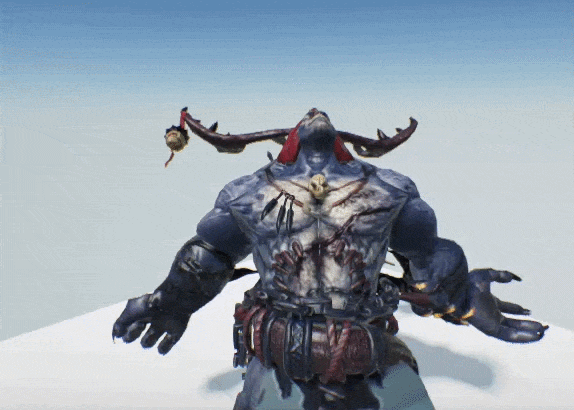 | 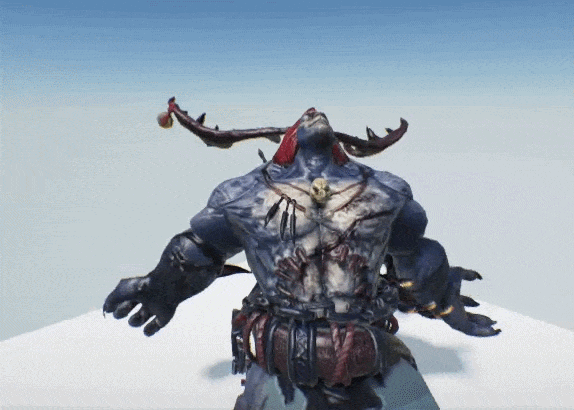 |

New **Spring Bone Physics** node simulates soft, physics-based trailing motion―like antennae, tails, or cloth strips―for a connected chain of skeletal bones. The root bone stays fixed to your normal animation, while each subsequent bone follows along with dynamic, secondary motion (sway, flutter, jiggle), automatically reacting to gravity, wind, and movement in a natural way. You can control how stiff, heavy, or flexible the bones feel, limit how sharply they can move, and combine with any standard animation system (this preserves your character's main animations, only affecting the simulated bones).

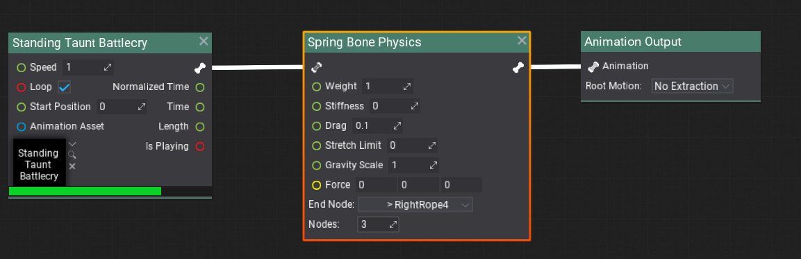

### New Look for Graph Editor

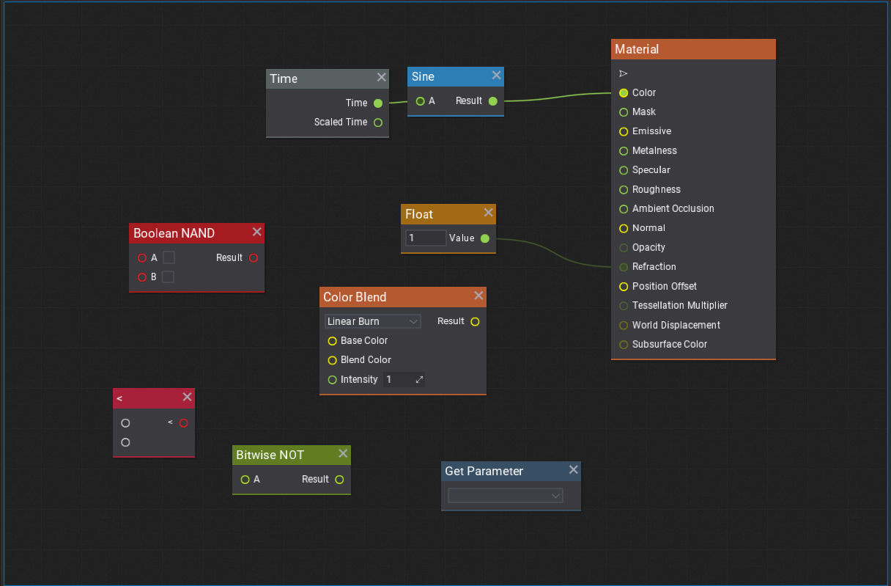

*Visject*, codename for our graph editor, has been updated with a new colorful style. It greatly **improves readability of the graph**. Materials, Particle Emitters, Behavior Trees, Visual Scripts, and Animation Graphs editing becomes smoother and more pleasant.

There have been a lot of changes and iteration, too many to list them all. To name a few:
* nodes will now auto resize based on their contents,
* nodes now have a slight shadow and a faint grid has been added to the background,
* selection outline thickness has been increased,
* margins and padding around node layout have been refactored,
* various nodes got alternative titles to improve searching for them,
* curve nodes can be resized,
* selected nodes can be focused by pressing `Shift + F`,
* node header is now colored, which allows to quickly recognize the type of node.

### MSDF Fonts

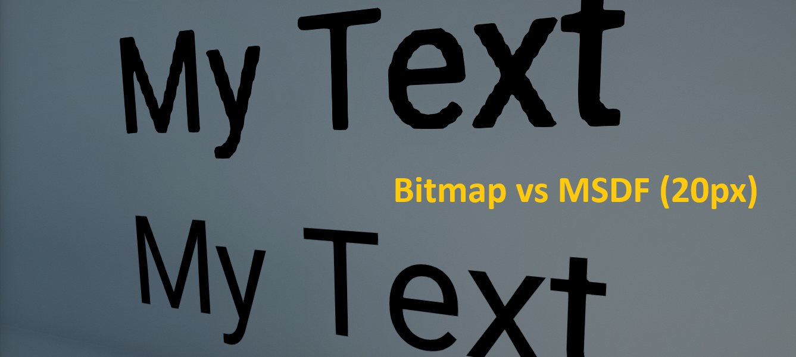

**Multi-channel Signed Distance Field** (`MSDF`) fonts are coming to Flax! This font rasterization algorithm calculates a distances to the glyph edges which provides high-qaulity fonts at large scales. Additional benefit of MSDF is ability to make interesting text effects such as outlines, glow, shadow, procedural texturing and more.

### DDGI is Production Ready

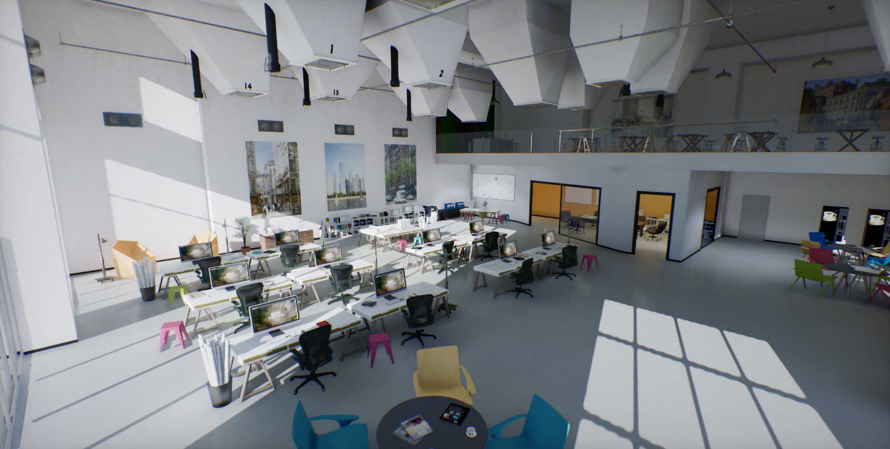

Over the past months, we've pushed various improvements to our implementation of [Dynamic Diffuse Global Illumination](../../graphics/lighting/gi/realtime.md) (DDGI), which result in faster and **improved raytraced realtime GI** (based on software tracing SDFs). Long-standing issue with color shift towards yellow was fixed, and indirect shadow areas now have higher contrast. Probes sampling algorithm has been refactored to support fallback probes when drawing pixels in areas without nearby GI information. This fixes lighting on smoke particles or characters in large rooms or open-world maps where GI probes are placed far from lit objects.

On the topic of rendering, Screen Space Reflections tracing has been refactored to use Hi-Z buffer and more optimized combine pass, which greatly improves its performance. Also, we've managed to reduce resolution of Volumetric Fog while maintaining its quality by performing better temporal sampling and filtering. Now, [Graphics Feature Tour project](../../samples-tutorials/samples/index.md) is **running at around 150fps in native 4K resolution (3840x2160) without any upscaling on RTX 2080 Ti**. More complex scenes should benefit too, for example [Flax Tech Demo 2022](https://store.steampowered.com/app/2138130/Flax_Engine__Tech_Demo_2022/) gets about 10% boost.

### Direction Gizmo

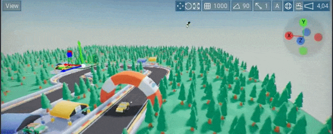

Ever felt lost in 3D space? Don’t worry, the **new direction gizmo**  will show you the way (upper rigth corner). You can use it to see what way the editor camera is facing or click on one of the axis circles to make the camera look from that direction. It can be toggled or adjusted in Editor Options.

### *Good Game* View

By pressing *G* Editor will hide all widgets, as well as debug draw, from the main editor window. Don’t worry, you can restore all of that by pressing *G* again. You can also **press *P* to toggle navmesh debug draw** visibility.

### SDL Platform Backend

Flax implements own abstraction layer over the platform APIs, such as windowing, input, filesystem, logging, etc. This allows running the same large engine codebase across different platforms such as consoles, mobile and desktop. On Linux, we relied on our implementation of `X11` for windowing and input processing, which wasn't stable enough for advanced users. That's why we've added option to compile engine with `SDL3` library to handle inputs and window management. Flax uses SDL on Linux by default now, optionally can be compiled on macOS and Windows too.

Now, **Linux devs can use Wayland or X11** and get a far more stable user experience when developing games with Editor on Linux.

### Tree View in Content Window

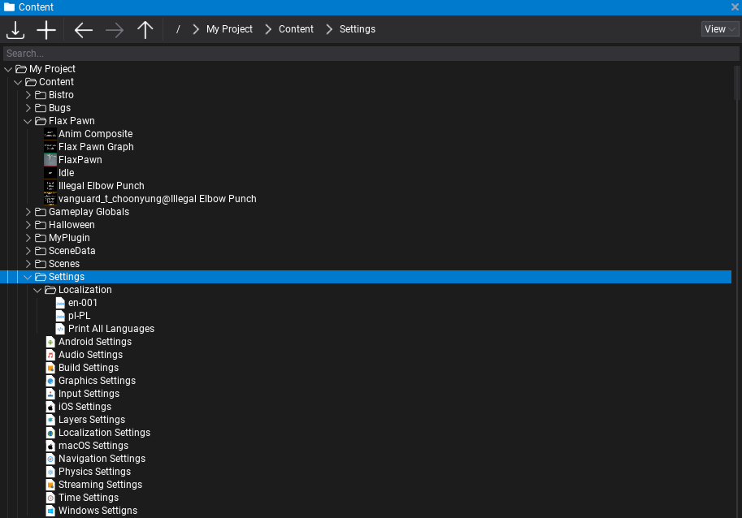

Content window now features a more **compact tree view**. It shows folders and items in one expandable and collapsible tree. This means you can now dock the Content panel next to other windows while still preserving full functionality.

### Box Projection on Environment Probes

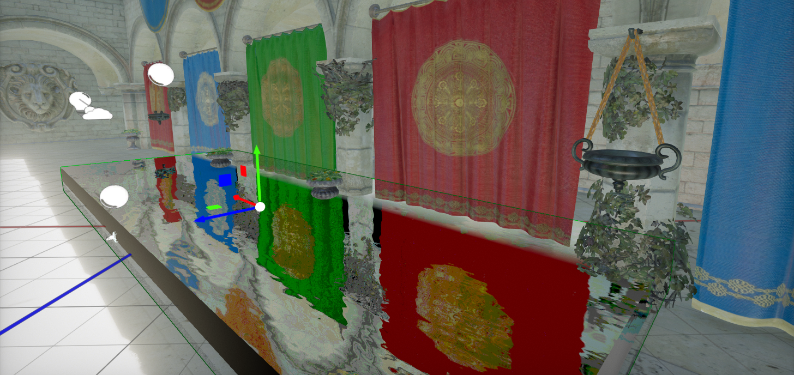

Environment Probes got a new *Box Projection* option to setup reflections for interiors in a more optimal way. It makes the reflections parallax correct as if they were cast by the oriented box volume, rather than a spherical shape.

### Visject Wrangler

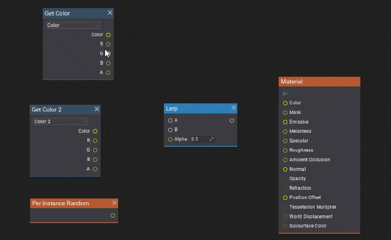

Connecting nodes is a thing you do a lot in a graph editor. Flax 1.12 introduces a **lazy connect feature**. To use it, simply hover the mouse cursor near a node, hold the *Alt* key and *Right Mouse Button* down, and drag towards another node. Flax will automatically make the best connection between both nodes. You can now also **slot nodes into existing connections**. To do that, drag a node over a connection between two nodes. Flax will automatically connect the node and **move other nodes to make space** if that is required. It is now also possible to **remove a node from an existing connection while keeping the other nodes in that connection** by moving the node while holding *Alt*.

### Linear Color Space Workflow

Flax lighting and texturing pipeline had a bug where imported color maps weren't matching sRGB curve properly. Engine post-processing and tonemapping were adjusted to make it look somewhat correct but the colors were not exact as they should be. Flax 1.12 ships with a new option `Gamma Color Space` in [Graphics Settings](../../editor/game-settings/graphics-settings.md) that is checked by default and retains the old behaviour. However, we recommend new projects to disable it and **use Linear Color Space workflow**, which imports textures with correct sRGB handling. See `Migration Guide` section below to learn more. In the near future, we plan to migrate to the new behaviour by default for all new projects.

### New Debug Tools

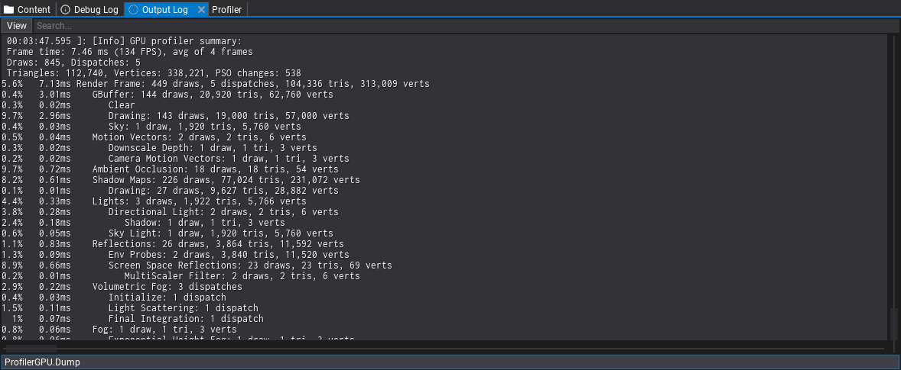

Use new `ProfilerGPU.Dump` command to quickly profile rendering performance. It works both in Editor and Game builds (`Development`/`Debug`) and outputs the summary of the frame stats with breakdown over the drawing events hierarchy, each with duration in milliseconds and percentage of the frame time. By default, it measures performance over `4` frames and averages results for more accurate A/B testing.

Additionally, `GPUDevice.DumpResources` command logs all GPU resources with detailed memory and usage stats for advanced debugging.

## Migration Guide

### sRGB Textures and Linear Color Space

[Graphics Settings](../../editor/game-settings/graphics-settings.md) have a new option `Gamma Color Space` that controls the logic of importing sRGB color textures. It's checked by default and preserves the existing behaviour of the engine, meaning projects will remain unchanged and will continue using the same texture options and color processing. When unchecked, color textures imported as sRGB will be properly lit to output exact colors as input textures. This option affects the final image presentation to the window backbuffer, meaning all lighting operations are correctly performed in linear color space.

This option can be used in existing projects. To perform migration, we recommend:
* unhceck `Gamma Color Space`,
* reimport all `sRGB` textures,
* adjust Post Processing settings:
  * Global Saturation to `1.1`,
  * Global Gamma to `0.9`,
  * Pre Exposure to `-0.5`,
* use `Linear to sRGB` and `sRGB to Linear` nodes in materials,
* follow [new documentation](../../graphics/lighting/color-space.md).

### API Changes

* Point and Spot lights using `InverseSquaredFalloff` are now fixed and don't need high `Brightness` values (old values auto-convert).
* `CreateWindowSettings::IsRegularWindow` is deprecated in favor of new `WindowType` enum.
* Visject Surface API was changed a lot, see repository for the detailed changelog.

### Known Issues

* On Linux with `X11` the new `SDL` platform backend doesn't work with drag&drop if `XInput2` is active. Use Wayland (`-wayland` command arg) or compile engine with `SDL: false` for Linux on X11.

### Platform Updates

We've updated minimum versions of various platforms to support the latest features and stability:
* macOS - XCode version `16.4` (or newer),
* Android - NDK version `27` (or newer).

## Changelog

### Version 1.12.6912.0 - 24 April 2025

Contributors: mafiesto4, xxSeys1, GoaLitiuM, Yahasana, Tryibion, VitaminCpp, AcidicVoid, Inertia-Squared, ThePhantomMask, socialtwisty, lifeformed, fibref, Menotdan, alsed, envision3d, Zode

PRs merged: 110

* **Add Web export support**
* Add new collection type `ConcurrentDictionary`
* **Add new SDL support as a base for input and widowing on Linux, Mac and Windows** (used on Linux by default for now)
* Add `-lastproject` and remember last project directory in project file dialog
* Add support for `.hpp` and `.c` files in Editor
* Add option to render `Canvas` into `GPUTexture`
* Add **MSDF fonts rendering support**
* Add utility function to `GUICommon.hlsl` for MSDF fonts sampling in shaders
* Add `UNITS_TO_METERS_SCALE` to shader sources for world units scale
* Add Git repository branch name and commit hash injection into generated code module metadata
* Add allowable characters enum to text box
* Add support for running engine with a single-thread only (content, jobs, drawing, physics)
* Add `WindowType` enum to `CreateWindowSettings` for more flexibility
* Add **WebGPU rendering backend for Web**
* Add platform-specific APIs to C# scripting (eg. `AndroidPlatform.DeviceModel`)
* Add modern message box style on Windows
* Add limit to max DDGI cascade updates per-frame to `2`
* Add ability to loop root node in behavior trees
* Add `Triangles` to `MeshAccessor` for easy index buffer access
* Add new and **improved color picker** in Editor
* Add tree view mode for Content window
* Add improvements to `RadialMenu` control scripting
* Add alternative node titles to pack/unpack nodes
* Add lazy connecting to Visject nodes via `Alt + right-click and drag`
* Add option to focus selected Visject nodes with `Shift+F`
* Add **direction gizmo in Editor viewport**
* Add scrolling scene tree hierarchy to the newly spawned actor after drag and drop
* Add memory profiler category for Cloth
* Add `UnusedStorageLifetime` for asset file TTL
* Add **new Visject surface editor style for better readability**
* Add larger input fields to Visject surface
* Add bigger default size of Editor windows
* Add selected code editor name to UI button for scripts project opening
* Add option to disable shadows on transparent material
* Add `CanSpawn` to `ParticleEffect` for runtime control over particles spawning
* Add `LongitudinalSlip`/`LateralSlip` to wheel state
* Add `Per Instance Random` node to Anim Graph
* Add `Instance Transform` node to Anim Graph
* Add **Spring Bone Physics** node to Anim Graph
* Add `Drag` and `StretchLimit` to `SplineRopeBody` for more advanced simulation control
* Add `Start Distance` to Volumetric Fog to match Exponential Fog more
* Add additional way of loading unsupported texture formats via Texture Tool conversion
* Add new `IgnoreNodesScale` option to skip skeleton nodes scale during import
* Add `Platform.GetUserLanguage` for text localization, separate from locale used for numbers, currency and dates
* Add `Localization.GetLocales` to list all languages in a game
* Add docs about conditional features in public API
* Add various improvements to `MeshAccessor` such as `ComputeNormals` and `ComputeTangents`
* Add debug drawing particle collision modules
* Add automatic recognition of Skinned Models for Prefabs
* Add model import option to only create material slots
* Add small improvement to terrain normals`
* Add sampler slots usage and inputs/outputs count to GPU shader program bindings meta
* Add `GPUDevice.DumpResources` command and fix output to be sorted by size and cleaner to read
* Add `GPU_ENABLE_PRELOADING_RESOURCES` and use it on Web/Android/iOS to reduce engine resources preloading
* **Add Box Projection to Environment Probe** for better indoor areas
* Add `CaptureOffset` to Environment Probe
* Add sharpening and better AABB history clamp to Screen Space Reflections temporal filter
* Add `OnSerializing`/`OnSerialized`/`OnDeserializing`/`OnDeserialized` callbacks to auto serialization code-gen in C\+\+
* Add `RenderColorFormat` option to graphics settings for rendering pipeline buffer format
* Add renaming underlying GPU resource (eg. for pooled render targets)
* Add normalization to Reflections debug view to be usable in HDR scenes
* Add `ShaderProfileFeatures` for more expendable shader feature sets
* Add `basis_universal` support for textures on Web
* Add implementation for loading interchange texture formats with multiple runtime formats support
* Add SPIR-V compression with LZ4 of Vulkan shaders (35% avg smaller)
* Add `.dds` file import support to Editor on Mac and Linux
* Add recycle bin to script deleting
* Add editor status message about amount of selected actors
* Add `View` button to edit Environment Probe texture asset
* Add `ProfilerGPU.Dump` command for GPU frame profiling log
* Add DirectX12 Agility SDK to third-party includes
* Add screen vignette to Eye Adaptation histogram for more accurate exposure
* Add `Linear to sRGB` and `sRGB to Linear` nodes to materials
* Add checkerboard pattern to part of the alpha slider background in color picker
* Add support for picking colors in linear color space (with toggle for special cases like UI)
* Add code signing and disk image notarization for macOS game cooking
* Add file type filters to file dialog on macOS
* Add new GPU Query API that is lightweight and supports occlusion queries
* Add CPU profiler events to texture and buffer creation
* Add support for Depth Bounds test in all graphics APIs
* Add `Graphics.TestValue` general purpose utility for A/B testing features and perf in shaders during development
* Add **improvements to Volumetric Fog quality and performance**
* Add dithering to Volumetric Fog to reduce aliasing
* Add smoother shadowed lights scattering by using medium shadow quality in Volumetric Fog
* Add `Focused` event to control
* Add improved Global SDF quality and precision of rasterization
* Add better debug view for Global SDF to include surface hit normal
* Add force SDF rebuild when holiding `F` key and using Build All Meshes SDF optino in Editor menu
* Add option to skip loading Model SDFs in game if disabled in Graphics Settings
* Add improved local-light shadow raytracing by starting ray from light, not surface
* Add FPS limit and pause option when game is unfocused
* Add verbosity level to platform log for better integration with Web and Android platforms
* Add Dead Zone to virtual input action for better usage with gamepad sticks/triggers
* Add create file Content Panel toolstrip button
* Add option to keep Content Window new asset options disabled when not possible rathenthan hidden
* Add warning when importing texture that is non-power-of-two and cannot generate mip maps
* Add improvements to particle age/lifetime nodes documentation
* Add `Script obsolete` and `Script only in prefab instance` buttons to the script header bar
* Add `IncludeInheritedTypes` to `RequireActorAttribute`
* Add some utility for copying parameter names to parameter right clickmenu
* Add improved orthographic/perspective viewport camera toggle
* Add UI editor grid toggle
* Add improved readability of highlighted text in drop-down menus
* Add better moving tools for UI widgets
* Add new actor transform and UI transform editor skin
* Add input `GamepadButtonDown` and `GamepadButtonUp` events
* Add `Set Parameter` node to Anim Graph
* Add `Vector4` normalize APIs
* Add special query for closest point on Physx heightfield
* Add `Collision Meshes Postfix` to filter collision meshes inside imported model via ending
* Add `Auto` collision option to handle imported or created model collider asset
* Add saving viewport icons scale (global) within Editor window layout
* Add view flag to hide particles drawing
* Add Texture Group option for triplanar and procedural samplers
* Add memory profiler category for engine debug data
* Add incrementing/decrementing value box value with arrow keys
* Add being able to move move Visject nodes in smaller increments
* Add ribbon menu buttons to quick open product local folder
* Add support for entering numbers with digit separator into value boxes (f.e. `1_000`)
* Add `*` to editor settings window title when settings are dirty
* Add Game View toggle via `G` ket and Navigation debug draw toggle via `P` key
* Add keyboard navgation to context menu child menus
* Add tab navigation to Editor context menus and popups
* Add curve editor presets
* Add moving selected curve keyframes with arrow keys
* Add support for resizing Visject Curve nodes
* Add support for building dependencies with specific architecture
* Add support for Visual Studio 2026 as a generator for CMake dependencies
* Add `ShouldSerialize` to `ISerializable` to properly handle serialization of custom C\+\+ types in prefabs
* Add comment around asset from which asset reference graph originates
* Add highlighted color property to Dropdown control
* Add Network RPC messages splitting for large arguments payloads
* Add improvements to attribute editor
* Add X11 Class hints to Linux-based windows
* Add Mono AOT dynamic module preloading to speed up startup time
* Add support for Cooperative Suspend when running on Mono
* Add support for Visual Studio 2026 as a generator for CMake dependencies
* Add stripping DXIL debug data from the shader cache when not used
* Add `AutoAttachDebugPreviewActor` for Behavior Tree editor
* Update XCode min version to `16.4`
* Update meshoptimizer library to `1.0`
* Update to `NDK 27` as minimum for Android to fix 16kb page alignment issue on `libc++_shared.so`
* Optimize engine binary size on Windows and Android (smaller PhysX)
* Optimize actors copy/paste data to use a single JSON for all objects
* Optimize `MMethod::GetParameterIsOut` to cache all parameters in a single bit-flag
* Optimize `VariantType` name allocs to use static type when possible
* Optimize out loading texture `DefaultLensDirt` if it's not needed
* Optimize updating Animated Model bones buffer when it's not dirty
* Optimize Animated Model bones buffer flushing with delayed draw action to reduce lock contention
* Optimize Anim Graph retarget to use cached pose to avoid dynamic memory allocation
* Optimize `SkinnedModel::GetSkeletonMapping` to not use locking for better perf when multi-threading
* Optimize Volumetric Fog on 2k/4k displays by limiting res to 1080p
* Optimize reflection probes rendering by using depth test to reject occluded pixels early
* Optimize reflection probes, lights and shadow projections rendering with depth bounds test
* Optimize `LOG()` macro to use stack-allocated buffer for shorter texts
* **Optimize Screen Space Reflections tracing with Hierarchical Z-Buffer**
* Optimize shadow maps rendering by using new `Graphics.Shadows.MinObjectPixelSize` to skip sub-pixel objects
* Optimize `VariantType` to use static type name in game or from non-reloadable assemblies
* Optimize `GPUVertexLayout` caches with `ConcurrentDictionary`
* Optimize Global SDF tracing to not scale steps nearby geometry and properly trace mip cascade
* Optimize `RendererAllocation` by reducing fragmentation with operating on power-of-2 blocks
* Refactor Mesh SDF generation on GPU to use raytracing for more precise results
* **Refactor DDGI irradiance filtering** for smoother and more accurate lighting
* **Refactor DDGI irradiance sampling** when nearby probe is missing to use precomputed fallback probes
* Refactor DDGI fallback radiance to use alpha for blending between fixed color and color at snapped location of the last cascade
* Refactor model LOD transition to run only when any material uses `Dithered LOD Transition`
* Refactor navmesh building to support updating all scenes automatically without specifying one
* Refactor `Animation` editor to use cloned asset for live preview of nested animations editing
* Refactor Job System to reduce mutex usage with more atomic operations
* Refactor `ScreenUtilities` into `Window` to be implemented per-platform but Editor-only feature
* Refactor Editor windows docking system
* Refactor `DrawModes` field in `StaticModel` and `FoliageType` into property with getter/setter
* **Refactor sRGB import option on textures** to actually handle image contents with gamma
* Deprecate `GPUTimerQuery` in favor of new queries API
* Update DXC shader compiler to `1.8` version (for D3D12)
* Rename `GPUContext::ClearState` to `ResetState` for constentency
* Remove `NeedsHitNormal`/`HitNormal` feature from `GlobalSDFTrace` to simplify code
* Fix shaders on Xbox to be precompiled
* Fix game viewport scaling when using custom aspect or resolution to simulate actual logic
* Fix animation state transition inputs when using other surface context
* Fix being able to open or close script editor with no fields
* Fix skinned model retarget source asset filter to work after `AssetPicker` refactor with new validator
* Fix invoking Anim Event on the first or last frame
* Fix invoking asset load event if it's referenced directly
* Fix check method for type editor not working in a collection
* Fix Visject Surface node dependent connection types init on load
* Fix issues with model data storage when doing long actions in async (eg. SDF generation)
* Fix prefab preview to better match model bounds inside it
* Fix prefab preview to wait for the assets streaming
* Fix `Time::Synchronize` not reset time on unpause
* Fix internal function name collision with base class function in bindings
* Fix text box selection height on macOS with custom system scale
* Fix compiler error and wrong CPU architecture warnings on WoA
* Fix spline Bezier drawing when using tangents offsets
* Fix shader compilation with HLSL 2021
* Fix sampling Global SDF gradient at lower border
* Fix Global SDF trace loop limit down to prevent too long shader execution in extreme scenarios
* Fix DDGI iradiance to use debanding by applying quantization error to reduce yellowish artifacts due to `R11G11B10` format
* Fix DDGI cascades blending to be smoother
* Fix DDGI flickering on floors aligned to world axes
* Fix directional light cascaded shadow maps rendering stability
* Fix AOT libs cooking to avoid file dirtying for more accurate iterative cooking
* Fix async tasks destruction to wait on the dependencies in chain
* Fix material shader generation when material layer fails to load
* Fix shader graph assets loading to wait for async task
* Fix blend shape always applying zero weight if default weight is zero
* Fix out-of-bounds write while parsing command-line arguments
* Fix `Array::RemoveAtKeepOrder` to avoid memory override with large mem copy
* Fix `HashSet`/`Dictionary` compact rehash under heavy collisions
* Fix collections capacity growing to use the closest power of two
* Fix C# project configuration of launch Game to matych selected config in Visual Studio
* Fix debugging VC\+\+ projects in Rider Linux/macOS to launch correct configuration
* Fix exception thrown when reloading open windows
* Fix clang bindings code generation for non-const ref parameters
* Fix missing scripting api tag on `MeshAccessor::Stream`
* Fix managed wrapper function parameter handling for `BytesContainer` and managed boolean array
* Fix incorrect class namespace in bindings class name lookups
* Fix compiling C# scripts that use `nuget` package to properly resolve it on 1st build
* Fix missing move semantics in script object reference
* Fix `Resize to Fit` to properly dirty state of level editor
* Fix group element header text clipping
* Fix issue with Editor tabs not collapsing panel 1 if no tabs on panel 1
* Fix Editor tree node not expanding on drag over arrow
* Fix C# Json serialization to use proper value comparison for structures with Scene Object references
* Fix showing C\+\+ structures inlined in collection editor when they have a single property/field
* Fix sRGB between Linear conversion to remain Alpha unchanged
* Fix sky, skylight and reflections banding artifacts with a random noise
* Fix yellowish artifacts due to quantization error in TAA and composite image output
* Fix dark Screen Space Reflections in some spots when using Software Tracing
* Fix Volumetric Fog rasterization on Vulkan (inverted Y axis)
* Fix Volumetric Fog to not flicker on temporal blend when resizing the screen or changing quality
* Fix Volume Particles to apply opacity/mask into emission for proper shape
* Fix small lights and small particles rasterization into Volumetric Fog 
* Fix missing DDGI on D3D11 when object counter readback buffer doesn't have data on time
* Fix Vulkan synchronization between CPU and GPU to prevent running over `frames in flight`
* Fix showing folder contents on macOS in Finder
* Fix various DPI issues on macOS in Editor
* Fix various missing features from window-management on macOS
* Fix shadows from wireframe materials
* Fix missing `ChannelMask` parameter type clone for Material Instance
* Fix loading cube texture import settings
* Fix missing vertex counting in draws (use index count to approx) for profiler
* Fix parsing `else` preprocessor and `&&` conditions in bindings generator
* Fix rendering on Intel-based macOS to use integrated GPU primarly
* Fix missing parent tags when creating nested ones from code
* Fix rendering postfx with color grading only in use and optimize color grading LUT to be skipped when unsued
* Fix crash when control reference gets invalid in Editor
* Fix crash when showing cube or volume texture in `GPUTextureBrush`
* Fix UI raycast if UI is clipping children
* Fix double scaling raycast in canvas scalar
* Fix Rich Text Box vertical alignment of the inlined images and whole contents
* Fix GPU Vertex Layout usage with explicit offsets to properly hash and calculates stride
* Fix broken `DrawWireTriangles`
* Fix postfx material flicker due to lost asset reference
* Fix missing `OrthoSize` property serialization on `Camera`
* Fix animated model bounds to properly update after animation tick
* Fix `SplineRopeBody` simulation when moving spline actor
* Fix `Chromatic Distortion` to be based on `1080p` as reference for resolution-independent
* Fix drawing editor thumbnails when texture used by asset is using dynamic streaming
* Fix drawing incorrect LOD transition when using 2 cameras in a scene at once
* Fix environment probe selection to use closest one to the object
* Fix sending replication message to newly connected clients for objects that were not spawned
* Fix importing and using files without extension in Editor content
* Fix collection editor of scene object references to use compact inline layout
* Fix material slot comboboxes update when editing model material slots
* Fix rebuilding navmesh data for multiple scenes at once that share the same navmesh runtime
* Fix to not crash after unhandled exception
* Fix various issues with audio and video playback
* Fix missing audio on OpenAL when changing active device
* Fix restoring `NuGet` packages for target with multiple projects
* Fix restoring `NuGet` packages to run before project build to ensure files are downloaded
* Fix deploying `NuGet` packages to include the correct library file name
* Fix deploying `NuGet` packages to include dependencies (recursive)
* Fix restoring `Min Screen Size` of the model on reimport
* Fix mesh collision proxy setup for meshes using packed positions format
* Fix timescale in `FixedTimestep` particles update and when using Editor preview
* Fix missing material graph references
* Fix missing light shadow resolution serialization
* Fix rendering postfx with color grading only in use and optimize color grading LUT to be skipped when unsued
* Fix rare async task crash when it's canceled while dequeuing
* Fix replicated-object deduplication by hashing/equality on `ObjectId`
* Fix importing file when target location already exists
* Fix Editor state after loading a scene without compiled game modules
* Fix code editor default handling and missing custom code editor arguments
* Fix double-clicking on properties splitter bar to auto resize split
* Fix caret blink speed to make caret visible more of the time
* Fix rotation on UI handles which implements total parent rotation properly
* Fix textbox length set to `-1` for unlimited
* Fix `Control.LocalLocation` to use parent control `GetDesireClientArea` rather than `Bounds`
* Fix `Render2D.DrawRectangle` to avoid alpha overdraw on the corners when thickness is large
* Fix foliage dithered LOD transitions when using shadows
* Fix applying AO twice for lighting in Forward shading and use correct specular occlusion on reflections
* Fix Forward shading to match Deferred in fog and reflections rendering
* Fix texture GPU resource debug name in non-Release game builds to match the path in project
* Fix Vulkan timeout to be larger (5s)
* Fix Global SDF update when changing Draw Modes of the model
* Fix `MeshAccelerationStructure` to use `MeshAccessor` for proper mesh format access
* Fix showing internal surface parameters (eg. `Base Model` in `Anim Graph`)
* Fix show whole timeline and show whole timeline when animation is opened
* Fix `.pch` files rebuilds after MSVC toolchain updates
* Fix deadlock when hot-reloading scripts in Editor while `Animation` asset gets auto-saved
* Fix sphere with negative radius getting culled to early in physics collider debug draw
* Fix potential stack overflow inside `CustomEditor.RebuildLayout`
* Fix `MaterialBase::GetParameterValue` when parameter is not overridden
* Fix `MeshAccessor` to properly reference model asset data during the usage
* Fix `MeshAccessor` to validate buffer existence in C# API
* Fix `MeshAccessor.Stream` count for items not aligned to buffer start
* Fix invalid index buffer format returned by `MeshAccessor` when model is not yet loaded
* Fix `PixelFormatSampler.Write` in C# to actually work
* Fix missing `Custom Global Code` code generation in `Defines` stage
* Fix terrain collision geometry order to match heights buffer
* Fix root linkage for prefab instances copy pasted in Editor
* Fix pasted ghost prefab objects when paste target is not defined
* Fix broken prefab linkage when duplicating nested prefab instance root
* Fix shader error when using Position Offset in deformable material
* Fix binary asset dependencies tracking when dependent asset gets loaded later on
* Fix scripting bindings in searching virtual methods to invoke when there is a name and parameter count collision
* Fix using `Dictionary` as virtual method parameter in scripting bindings
* Fix Cloth to snap to the parent actor on spawn in Editor
* Fix Cloth with models that use compressed vertex buffer
* Fix missing doppler factor in cooked game with OpenAL backend
* Fix missing scale for inverse squared setting for lights
* Fix client-host replication issue
* Fix .NET 10 tooling detection
* Fix various material nodes to work on D3D12
* Fix memory leak in Editor when using material parameter query
* Fix camera preview placement in editor preview when resizing window
* Fix compute distance crash if no closest point param is defined
* Fix crash when destroying actor that was left in enabled state
* Fix crash when moving disabled kinematic actor target point
* Fix crash when unloading scene during tick of that scene
* Fix crash when reporting from multiple therads to sync and properly log (eg. out of memory)
* Fix crash when texture streaming mip task gets deleted after texture object on GC
* Fix crash if base material gets GCed before it's referenced by instance during loading
* Fix crash on Visual Script missing asset ref after hot-reload in Editor
* Fix crash on Global Surface Atlas objects buffer building
* Fix crash when inserting material functions
* Fix crash due to async content data streaming
* Fix crash due to missing asset reference inside `MeshAccelerationStructure`
* Fix crash on exit when C# code was bound to asset unloading event called after C# shutdown
* Fix crash on script VTable setup due to async
* Fix crash on invalid unpack node usage in shader graph
* Fix crash on shutdown when one of the windows had outstanding input events
* Fix crash on leftover window handle inside an input device events queue
* Fix crash on Vulkan when `vkGetPhysicalDeviceSurfaceFormatsKHR` returns `VK_INCOMPLETE`
* Fix crash when drawing minor foliage node with both children and instances
* Fix crash when creating empty material instance
* Fix crash when using overlapping instances
* Fix crash when applying prefab changes using default instance
* Fix crash when using convex mesh collider with negative scale
* Fix crash when loading `CollisionData` before physics init
* Fix crash when applying prefab changes
* Fix crash when changing prefab root
* Fix crash when loading Visject graph with a broken connection
* Fix crash when using `SkeletonMask::GetNodesMask` from 2 threads at once
* Fix crash when caching `DebugCommands` and classes cache gets modified
