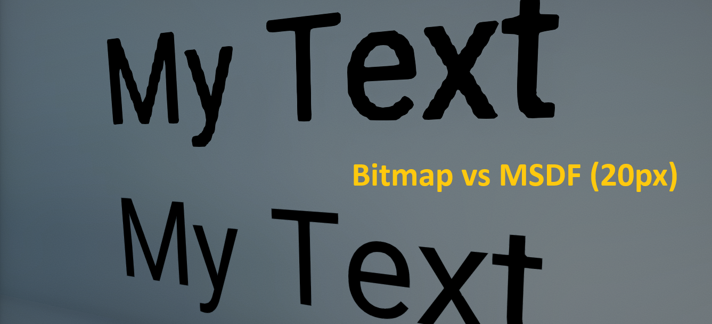

# Fonts

**Font Assets** are binary resources that contain information of font characters (and/or prerendered characters texture).
Flax performs the required importing, loading and rasterization of the font glyphs. Fonts are used by the 3D [Text Render](../text-render/index.md) actor, as well as the [UI](../index.md) system.

Flax uses the **FreeType** library for font character rasterization and offline rendering. Fonts can be rasterized into `Bitmap` or `MSDF` (Multi-channel Signed Distance Field generator from **msdfgen** library).

## Importing fonts

You can import font files to use as font assets in your project. Flax supports importing the following file types as fonts:

* `.ttf`
* `.otf`

The easiest way to import one or more fonts is to drag them from the file explorer to the *Content Window*.
Alternatively, you can use the **Import** button in the *Content Window* toolbar and then select the files to import.

## Font Window

**Double-click** on an imported font asset in the *Content Window* to open the dedicated font asset tool window.
You can use it to type text and preview the font.

## Font Properties

The font window can be used to preview and edit the font rasterization options:

| Property | Description |
|--------|--------|
| **Raster Mode** | The font rasterization mode. Possible options include: <table><tbody><tr><th>Option</th><th>Description</th></tr><tr><td>**Bitmap**</td><td>Use the default FreeType rasterizer to render font atlases.</td></tr><tr><td>**MSDF**</td><td>Use the Multi-channel Signed Distance Field (MSDF) generator to render font atlases. Need to be rendered with a compatible material.</td></tr></tbody></table> |
| **Hinting** | The font hinting used when rendering characters. Possible options include: <table><tbody><tr><th>Option</th><th>Description</th></tr><tr><td>**Default**</td><td>Use the default hinting specified in the font.</td></tr><tr><td>**Auto**</td><td>Force the use of an automatic hinting algorithm (over the fonts native hinter).</td></tr><tr><td>**Auto Light**</td><td>Force the use of an automatic light hinting algorithm, optimized for non-monochrome displays.</td></tr><tr><td>**Monochrome**</td><td>Force the use of an automatic hinting algorithm optimized for monochrome displays.</td></tr><tr><td>**None**</td><td>Do not use hinting. This generally generates 'blurrier' bitmap glyphs when the glyphs are rendered in any of the anti-aliased modes.</td></tr></tbody></table> |
| **Anti Aliasing** | Enables using anti-aliasing for font characters. Otherwise the font will use monochrome data. |
| **Bold** | Enables an artificial embolden effect. |
| **Italic** | Enables a slant effect, emulating italic style. |

## Bitmap vs MSDF

The default workflow for fonts uses `Bitmap` mode, which rasterizes character glyphs into a image (stored inside an atlas). Then character image can be sampled directly from it inside GPU shaders (atlas texture uses `R8_UNorm` format - 8-bit red channel). This method is efficient, fast to render and simple to integrate inside graphics pipeline as text sampling requires just a single texture sample.

The most common limitations of this technique are isuses when using large font sizes. Then, character glyphs images need higher resolution to avoid aliasing artifacts, which increases memory usage and limits scalability across different hardware, but even tho they might be visible (eg.  when using auto-sized text).

One of the solutions to this is fonts based on Multi-channel Signed Distance Field, shortened as MSDF. Instead of storing font glyph visibility inside a texture, rasterizer outputs multiple distance fields to the glyph edge and stores them in separate texture channels (`R8G8B8A8_UNorm` format - 8-bit red, green and blue channels are used). Then each pixel of such a character image contains signed distance to the glyph edge, which can be used to fill pixels that have a non-positive distance (are inside the glyph). The key advantage of this method is significantly lower resolution requrement to for image to represent fonts in high quality at large scale. Additionally, this technique provides *almost-free* way to implement more advanced text effects such as outline, glow, shadow or procedural texturing.

To learn how to create a custom material with shader for MSDF font see [this tutorial](../tutorials/create-outline-font-material.md).

## Fallback fonts

When font used to draw text doesn't contains certain characters (eg. non-Latin set, emoji or icon) then fallback fonts can be used. Flax supports using one or more fallbacks when the primary font lacks a glyph to be displayed.

To setup this feature assign `Fallback Fonts` property in [Graphics Settings](../../editor/game-settings/graphics-settings.md):

In Editor, in-built font is used as a fallback by default - can be configured in Editor Options. Leave that empty to use the ones from Graphics Settings.
