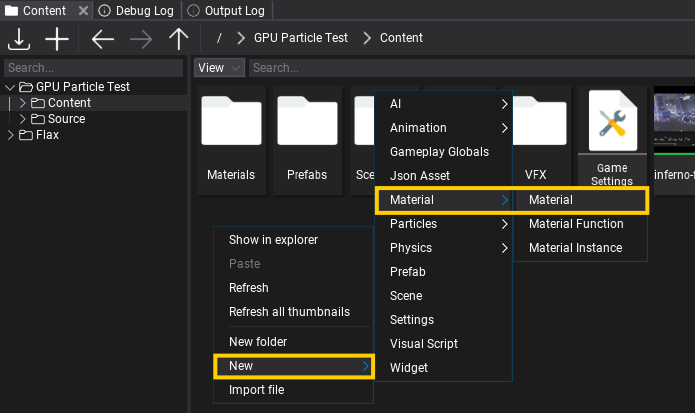
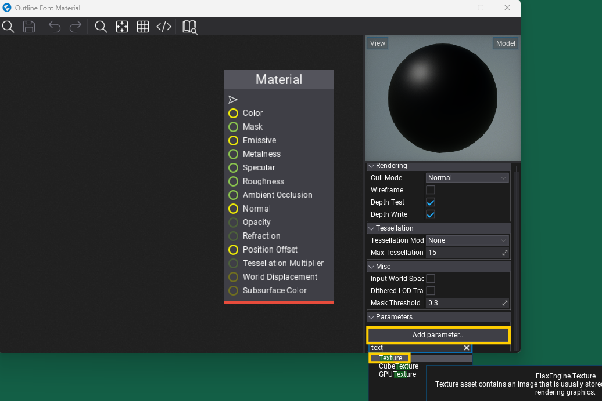
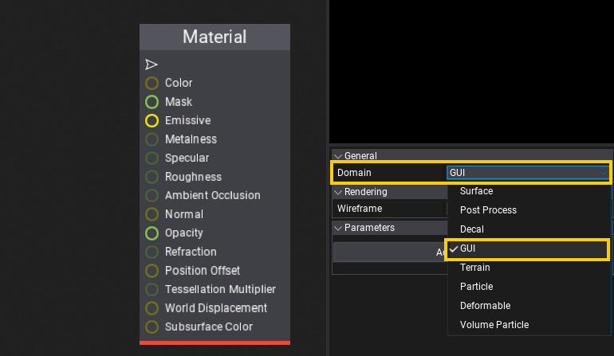
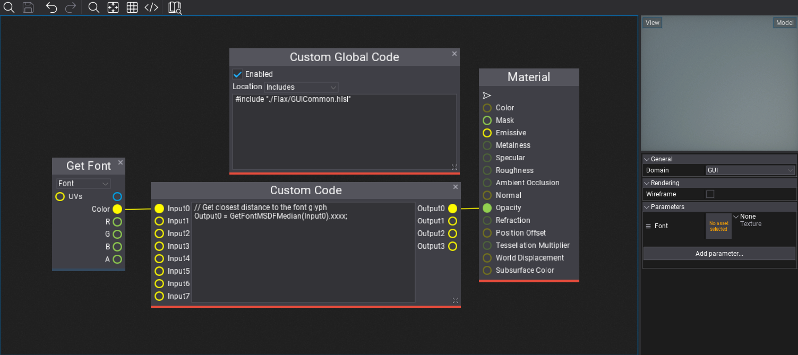
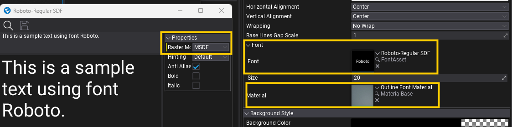
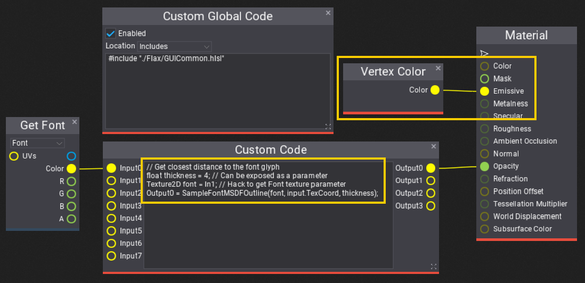

# HOWTO: How to create an outline font material

In this tutorial, you will learn how to create a font material that can be used to draw MSDF fonts with an outline effect. A similar approach can be used to implement shadow, glow, or procedural texturing using Sign Distant Field data stored for font character glyphs.

## 1. Create a new material asset

**Right click** in the **Content Window** and select option **New -> Material -> Material**. Type a name and confirm with Enter. Double-click on created asset and start editing material.



## 2. Create a texture parameter named **Font**



Scroll down the material properties panel and select the new parameter type **Texture**, then press **Add parameter**. Next **double-click** on a label with created parameter name and rename it to **Font** (Flax uses a parameter named `Font` to bind the font atlas texture during rendering).

## 3. Change Domain to GUI



Set Material Domain to **GUI** if you want to use this material inside UI Controls. If you want to use this material on Models or Text Render then leave it as default Surface (but use other plug than *Opacity* if material is opaque).

## 4. Set up the material graph



In this step you need to create a material using shader code blocks as shown on a picture above.

Add a new **Custom Global Code** node and set it;s **Location** to **Includes**, then write the following code there:

```
#include "./Flax/GUICommon.hlsl"
```

This will ensure that various GUI and font sampling utilities will be included to use inside a shader file.

Then add similar node **Custom Code** with the following code:

```
// Get closest distance to the font glyph
Output0 = GetFontMSDFMedian(Input0).xxxx;
```

Finally, drag and drop `Font` parameter (from proprties panel on the right) to sample the font texture. Plug the font `Color` output into the first `Input0` of the Custom Code node, then connect `Output0` from that node to the output `Opacity` of the material.

## 5. Assign the material



Now, create a new `Label` control, set it's Font to asset that uses `MSDF` as `Raster Mode` and plug the created material into the `Material` property. Ensure that font size is not too small to ensure SDF data is correct. Values around 20 are usually a good starting point.

Now, you should see a basic SDF font rendering that will look like a shadow-like gradient of the text:


## 6. Make an outline



Finally, let's pump up the shader to draw an outline of the text and use color from vertex, which will be passed by rendering system directly from the control rendering.

Edit the *Custom Code* node:

```
// Get closest distance to the font glyph
float thickness = 4; // Can be exposed as a parameter
Texture2D font = In1; // Hack to get Font texture parameter
Output0 = SampleFontMSDFOutline(font, input.TexCoord, thickness);
```

Final result:


